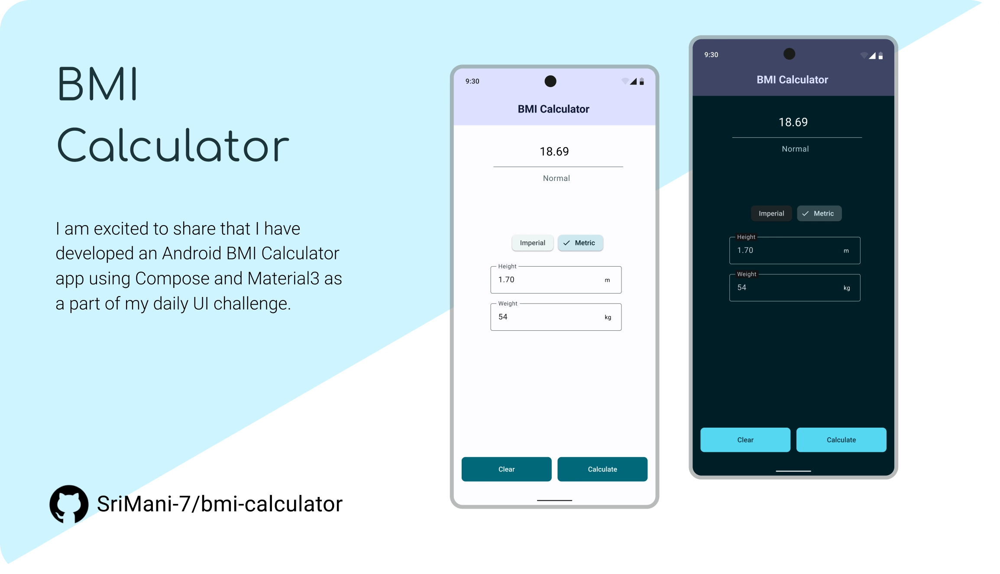

# Bmi Calculator 📏

</img>

This is a simple Android application that calculates the Body Mass Index (BMI) of a user based on their height and weight. It was built using Jetpack Compose and Material3 design system.

## Features ✔️

* Calculate BMI based on user's height and weight input.
* Displays a BMI result and a corresponding category of BMI.
* Responsive UI for different screen sizes.
* Built with Material3 design system, providing a modern and consistent UI design.

## Requirements ✍️

* Android Studio Electric Eel | 2022.1.1 or above
* Jetpack Compose version 1.4.0
* Kotlin 1.8.0
* Android SDK 33

## Getting started 🏋🏻‍♂️

To run this project, follow these steps

1. Download / Clone this repository.
2. Import project into Android Studio.
3. Build and run the app.

Here the brakedown diagram

</img>

## License

This project is licensed under the **Apache 2.0 License**. See the [LICENSE.md](LICENSE.md) for more details.

## Contributing 💡
If you want to contribute to this project and make it better with new ideas, your pull request is very welcomed. If you find any issue just put it in the repository issue section, thank you.

Please ⭐ this repo and share it with others